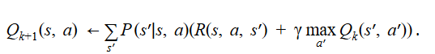
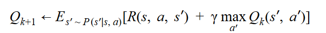
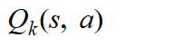
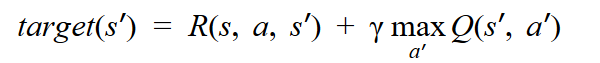
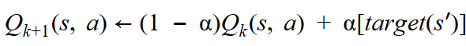
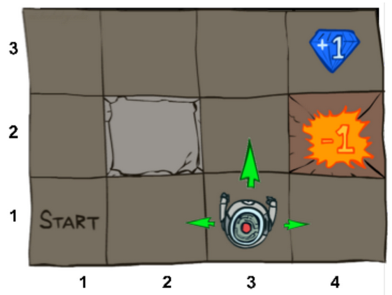

# Q-Learning
There are drawbacks, like requirement of knowing the dynamics of the environment, which we face when using techniques like [Value Iteration](https://github.com/piyush2896/ValueIteration-RL) and [Policy iteration](https://github.com/piyush2896/Policy-Iteration). To overcome this drawback we can use sampling-based approximation techniques like Q-Learning.

In Q-Learning we:
- Replace Bellman equation (written in iteration format):

- And write it in the form of Expectation:

- Now for a single state action *(s, a)* pair we can replace expectation by samples:
  - For a single state-action pair *(s, a)*, receive *s' ~ P(s'|s,a)*
  - Consider our old estimate: 

  - Consider our new estimate: 

  - Incorporate the new estimate into a running average: 

## Task at Hand
The task is to maximize a reward in a world that consists of an agent that can navigate in 4 directions - North, South, East and West. With a 20% of equally likely chance of deviating to left or right from the action asked to perform.

||
|:--------------------------:|
|*[Src: UC Berkley 2017 Deep RL bootcamp Lecture 1 slides](https://drive.google.com/file/d/0BxXI_RttTZAhVXBlMUVkQ1BVVDQ/view)*|

## Usage
Modify `main.json` to suit your needs. The key names are self explanatory. Then run `python main.py`.

You can also create your own `<user-defined>.json` file with every paramter defined and then run `python main.py --json_path <user-defined>.json`
